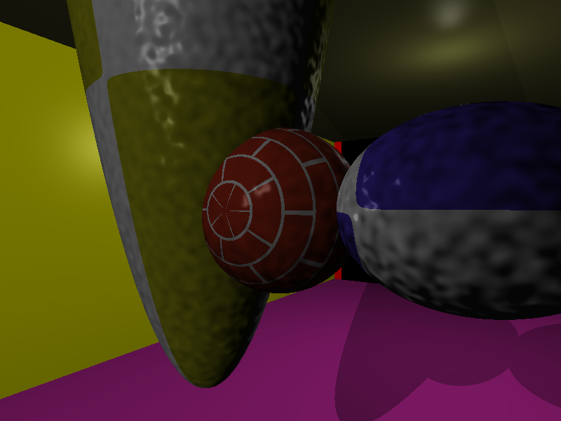

# RT 1337 Raytracer 

basic RTV1 scenes
4 basic objects (cone, sphere, plane and cylinder)

 
Camera position (configuration : position , look_at point, and fov)

 
multiple shadows

 
limited objects and some others supported objects

 
ambient : objects never fall in complete dark
 
scene
 
{
 
ambient : 0.5 0.5 0.5
 
}
 
to set ambient in configuration file

 
multiple light, multiples objects

 
normal pertubation with perlin noise

 
procedural texturing: marble, wood, chess, ...

 

Point Lights

 

Distant Light

 
Reflection

 
Skybox : cubic envmapping with reflective sphere

 
Refraction with texturing

 
Obj format is supported

 
Ellipsoid, paraboloid

 
Filters

 

Interface

 

The Interface is very intuitive ! Possible to save a series of photos for making a video, rotate the Camera
 
By Pressing Left or Right Key, When Changing Camera Position on the UI, Make Sure To Select an object with (Right Click)
 
Before clicking on raytrace, or press edit button before raytrace!
 

